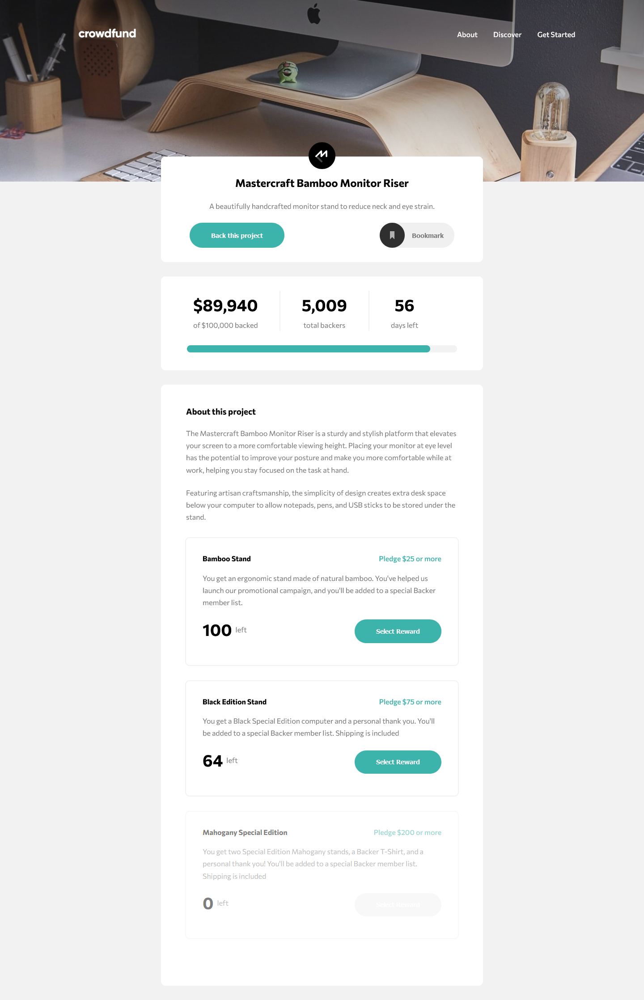
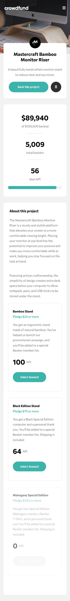

# Frontend Mentor - Crowdfunding product page solution

This is a solution to the [Crowdfunding product page challenge on Frontend Mentor](https://www.frontendmentor.io/challenges/crowdfunding-product-page-7uvcZe7ZR).

## Table of contents

- [Overview](#overview)
  - [The challenge](#the-challenge)
  - [Screenshot](#screenshot)
  - [Links](#links)
- [My process](#my-process)
  - [Built with](#built-with)
  - [Continued development](#continued-development)
- [Author](#author)
- [Acknowledgments](#acknowledgments)

## Overview

### The challenge

Users should be able to:

- View the optimal layout depending on their device's screen size
- See hover states for interactive elements
- Make a selection of which pledge to make
- See an updated progress bar and total money raised based on their pledge total after confirming a pledge
- See the number of total backers increment by one after confirming a pledge
- Toggle whether or not the product is bookmarked

### Screenshot

### Links

- Solution URL: [Frontend Mentor](https://your-solution-url.com)
- Live Site URL: [GitHub Pages](https://sofskrbic.github.io/crowdfunding-product-page-vuejs/)

## My process

### Built with

- [Vue.js](https://vuejs.org/) - JS library
- [Vuex](https://vuex.vuejs.org/) - Vue.js state management library
- Semantic HTML5 markup
- CSS custom properties
- Flexbox
- Mobile-first workflow

### Continued development

The next step of the project would possibly be fetching data from an API or including a database into its functionality. Considering it's a small project, state management with Vuex seemed like a reasonable solution.

## Author

- GitHub - [@sofskrbic](https://www.github.com/sofskrbic)
- Linkedin - [@sofskrbic](https://www.linkedin.com/in/sofijaskrbic/)
- Frontend Mentor - [@yourusername](https://www.frontendmentor.io/profile/sofskrbic)
- Twitter - [@sofskrbic](https://www.twitter.com/sofskrbic)

